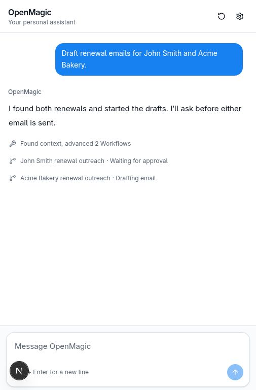
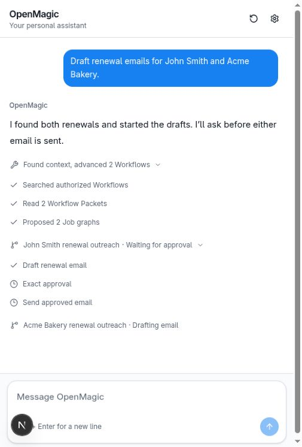
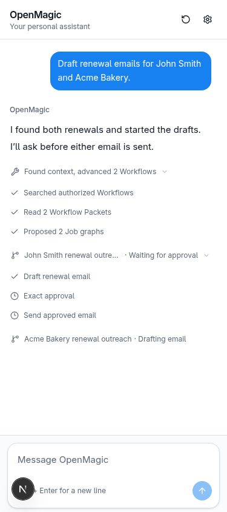

# Workflow telemetry presentation decision

Variant C is locked and implemented in the OpenMagic chat surface.

## Contract

A chat turn may carry sanitized Agent activity and zero or more durable
Workflows. Each Workflow owns its flat Job and checkpoint progress. The API
contract does not carry model reasoning or arbitrary nested tool output.

## Run

```bash
npm run demo:workflow-telemetry --prefix web -- -p 3010
```

Open `http://127.0.0.1:3010/?variant=C`. This development-only URL renders the
production component with a deterministic fixture. Normal chat routes populate
the same component from the live history API.

## Decision

Variant C, the hover-arrow Codex rail, is the selected direction. It keeps Agent
activity and each Workflow collapsed into one quiet line and supports independently
expanded Workflows.
Its chevron sits immediately after the summary, appears only on hover or
keyboard focus, points right while closed and down while open, and adds no hover
background. Expanded activity is a flat list of single-line status rows, with no
vertical rail, indentation, descriptions, durations, or nested disclosures. All
telemetry uses muted gray styling, and the down chevron remains visible while a
disclosure is open. Parent and child telemetry icons share the same left edge as
the assistant message text.

Variant C uses the official shadcn Accordion abstraction backed by Base UI.
Approval remains a checkpoint between Jobs, not a fake Workflow Job.

The production component lives in
`web/components/chat/workflow-telemetry/WorkflowTelemetry.tsx`. Assistant
messages accept telemetry through the chat history contract. The development
demo alone uses an in-memory fixture. Normal Workflow-mode history preserves
durable Cause correlation and attaches the current authorization-scoped
operational projection.

## Screenshots






