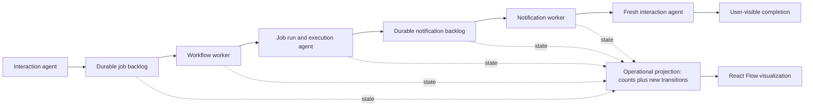

# Live workflow and backpressure visualization

Research snapshot: 2026-07-13, worktree commit `3268125`.

## Recommendation

Use **`@xyflow/react` with one small custom animated SVG edge**, and do not add Motion or D3 for the first demo.

React Flow is the best fit because the thing being shown is already a fixed node and edge system. Its official examples cover exactly the missing behavior: custom React nodes, animated SVG elements traveling along an edge, and a Web Animations API alternative for moving richer elements along the computed edge path. Its UI registry also includes a shadcn-installable Animated SVG Edge and Node Status Indicator. [Custom nodes](https://reactflow.dev/learn/customization/custom-nodes), [animating edges](https://reactflow.dev/examples/edges/animating-edges), [Animated SVG Edge](https://reactflow.dev/ui/components/animated-svg-edge), [Node Status Indicator](https://reactflow.dev/ui/components/node-status-indicator).

The current npm release is `@xyflow/react` 12.11.2. Official registry metadata declares `react` and `react-dom` peers as `>17`, plus `@types/react` and `@types/react-dom` peers as `>=17`. This includes this repo's React 19.2.3. [npm package](https://www.npmjs.com/package/%40xyflow/react), [official raw registry metadata](https://registry.npmjs.org/%40xyflow%2Freact/latest).

Use React Flow only for rendering and interaction. The server projection remains the source of truth for queue depth, worker state, runs, notifications, and completions.



## Why this fits the repo

- [`web/package.json`](../../web/package.json) is Next.js 15.5, React 19.2, strict TypeScript, Tailwind 4, and shadcn-compatible UI. It currently has no graph or animation dependency.
- [`WorkflowCockpit.tsx`](../../web/components/workflows/WorkflowCockpit.tsx) is already a client-side demo shell, and [`WorkflowGraph.tsx`](../../web/components/workflows/WorkflowGraph.tsx) is the natural replacement point. The current graph is a static vertical list driven by a deterministic local snapshot.
- [`CockpitTelemetryPanel.tsx`](../../web/components/workflows/CockpitTelemetryPanel.tsx) already demonstrates the preferred frontend boundary: poll a Next.js proxy, parse unknown JSON, retain the last good state, and display a reconnecting state. It polls every 1.5 seconds.
- React Flow custom nodes are ordinary React components, can use Tailwind, and its official Tailwind guidance supports importing the library stylesheet into the base layer so app styles win. [Theming and Tailwind](https://reactflow.dev/learn/customization/theming).
- The repo's [`components.json`](../../web/components.json) already supports the shadcn registry format used by React Flow UI. Prefer adapting the small official edge example over importing a large template.

## Options compared

| Option | What it gives us | Cost and risk | Verdict |
| --- | --- | --- | --- |
| **React Flow plus native SVG animation** | Graph canvas, computed paths, custom status/count nodes, fit-to-view, and official animated-edge recipes. Interaction can be locked with `nodesDraggable`, `nodesConnectable`, and selection props. [ReactFlow API](https://reactflow.dev/api-reference/react-flow) | One runtime dependency and its base stylesheet. Memoize custom nodes, edges, and data objects, as the official performance guide recommends. [Performance](https://reactflow.dev/learn/advanced-use/performance) | **Choose this.** It covers structure and animation with the smallest purpose-built surface. |
| **Plain React plus SVG, CSS, or Web Animations API** | No dependency and maximum deterministic control. React Flow's own example proves that `<animateMotion>` and `offset-path` are sufficient for particles. [Official example](https://reactflow.dev/examples/edges/animating-edges) | We must own responsive node placement, edge routing, hit areas, fit-to-view, and path updates. | Best fallback if adding a dependency is rejected. More bespoke layout work than React Flow. |
| **Motion for React** | Declarative HTML and SVG animation, enter/exit handling, keyframes, `offset-path`, and event-driven sequences through `useAnimate`. [React animation](https://motion.dev/docs/react-animation), [useAnimate](https://motion.dev/docs/react-use-animate) | It does not provide graph layout, handles, edges, or a viewport. We would still build the whole graph surface. The current `motion` 12.42.2 package supports React 18 and 19. [npm package](https://www.npmjs.com/package/motion) | Useful later for richer panel choreography, not needed for the first pipeline. |
| **D3** | Low-level path generators, transitions, force layouts, scales, SVG, and Canvas. `linkHorizontal` can generate the needed curves. [Link generator](https://d3js.org/d3-shape/link), [transitions](https://d3js.org/d3-transition) | Too low-level for a fixed seven-stage pipeline. D3's own React guide warns that selection and transition modules manipulate the DOM and compete with React unless isolated behind refs and effects. Type declarations come from DefinitelyTyped. [D3 in React](https://d3js.org/getting-started#d3-in-react) | Reject for this demo. Its flexibility adds coordination and testing surface without a matching need. |
| **AntV X6** | SVG and HTML graph canvas, React-rendered nodes, incremental node and edge updates, and an official edge example with both dash flow and a marker traveling along a curved path. [Edge animation source](https://github.com/antvis/X6/blob/master/site/examples/animation/usage/demo/edge.ts), [React nodes](https://x6.antv.antgroup.com/tutorial/intermediate/react), [model API](https://x6.antv.antgroup.com/en/api/mvc/model) | The graph lifecycle is more imperative, and automatic layout is a separate package. Current `@antv/x6-react-shape` metadata requires React 18 or newer, so it is compatible with this repo. [official raw registry metadata](https://registry.npmjs.org/%40antv%2Fx6-react-shape/latest) | Credible runner-up if edge animation becomes the dominant requirement. React Flow remains the smaller, more natural fit for the existing React state boundary. |

The most directly relevant official option is not another general animation library. It is React Flow's own **Animated SVG Edge** and **Node Status Indicator** patterns.

## Live data contract needed

The existing `/api/chat/telemetry/latest` response is turn-oriented. It contains activity and workflow stages, but not fleet-wide queue counts, worker capacity, notification backlog, or a cursor of newly observed transitions. Polling that response can therefore update labels, but it cannot reliably animate every pickup and delivery.

Add a dedicated, read-only operational projection for the demo with:

```ts
interface WorkflowSystemSnapshot {
  sequence: string;
  capturedAt: string;
  jobs: { waiting: number; queued: number; running: number; terminal: number };
  workflowWorker: { capacity: number; busy: number };
  runs: { active: number };
  notifications: { queued: number; running: number; delivered: number };
  notificationWorker: { capacity: number; busy: number };
  recentTransitions: Array<{
    id: string;
    kind: 'job_picked_up' | 'run_started' | 'run_finished' | 'notification_queued' | 'notification_delivered' | 'interaction_completed';
    aggregateId: string;
  }>;
}
```

Use bounded polling with an `after=<sequence>` cursor for the demo. This matches the existing reliable polling pattern, survives reconnects, and avoids missing short transitions. Counts are snapshot truth. A traveling token is only emitted for a newly returned durable transition ID.

## Presentation shape

1. Keep seven stable infrastructure nodes. Do not create one React Flow node per job.
2. Put queue depth, active count, and worker capacity directly in those nodes. Show backpressure as the queued count and a filling backlog bar.
3. Animate at most a small bounded number of representative tokens. A burst of 50 jobs should show `50 queued`, not render 50 expensive animated graph nodes.
4. Wire **Create workflow** and **Burst jobs** to real demo endpoints. Disable each button while its request is in flight and show the accepted count.
5. Lock editing interactions for interview reliability: no dragging, connecting, deleting, or selection. Keep `fitView`; disable wheel zoom unless the final layout needs it.
6. Add **Reset demo** and a deterministic replay fallback. Label replay mode clearly so it cannot be mistaken for live system state.
7. Respect `prefers-reduced-motion`: retain counts and status colors, remove traveling particles and pulsing borders.

## Truthfulness constraint

[`WorkflowRuntimeService`](../../server/services/workflow_runtime.py) currently describes itself as polling one Job and one Notification at a time, and its loop invokes the workflow worker before the main notification worker. The visual should therefore show the actual capacity as one unless the runtime changes. The scalable claim demonstrated today is durable buffering and decoupled processing rates. It is not yet a claim that multiple workers are active concurrently.

## Product command boundary

The interview surface should not turn the current `propose_renewal_email` tool into the long-term product contract. The generalized Interaction Agent boundary should be `propose_workflow_work`, with a closed, registry-owned discriminated union of business operations. Each operation owns its validated input schema and compiles to a Workflow proposal. The model must not supply executor keys, prompts, dependency graphs, retry policy, or notification routing.

The `/system` load controls call the typed `create_workflow` Control Plane command directly because they are engineering controls, not chat tools. They use the same registry-owned renewal graph and durable command path that `propose_workflow_work` should eventually target. This keeps the interviewer view compatible with the business-facing chat work without exposing orchestration vocabulary in chat.

## GAN Lab interaction model

[GAN Lab](https://poloclub.github.io/ganlab/) is the strongest product reference for the interviewer surface. Its explanatory power comes from coordinating five views and controls on one canvas:

1. A stable model overview graph explains architecture and data flow.
2. A layered distribution view shows the same live state in greater detail.
3. Metrics expose system behavior across time.
4. Replay, play, slow-motion, and step controls let the viewer control the explanation.
5. Tunable inputs change the real computation, while nearby prose explains what each visual encoding means.

The OpenMagic translation is a stable seven-stage infrastructure graph, a durable activity trace, queue and delivery metrics, real load controls, and an observed-state timeline. The browser retains up to 450 real PostgreSQL captures, roughly three minutes at the 400 ms poll rate. The viewer can pause, scrub backward or forward, and return to live state while new captures continue arriving.

The timeline is observational. It never rolls the database backward and never invents events between captures. Worker capacity also remains fixed at the actual value of one. A future capacity control should only appear after the runtime supports changing real worker concurrency.
