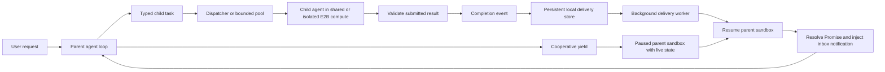
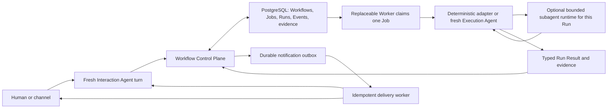

# Effective AI multi-agent runtime compared with OpenMagic

Date: 2026-07-12

## Bottom line

OpenMagic should continue with the PostgreSQL workflow control plane. Effective
AI's public architecture is not an alternative to that control plane. It is a
complementary execution-runtime layer that coordinates agents inside a unit of
work.

The clean architecture has two layers:

1. **Business workflow control plane:** durable objective, authority, jobs,
   attempts, exact approval, external-effect safety, evidence, and audit history.
   This is the layer OpenMagic is designing.
2. **Agent execution runtime:** typed subtask delegation, yielded waits,
   fan-out and fan-in, bounded concurrency, sandbox placement, and wake-up
   delivery. This is the layer Effective AI describes.

Effective AI validates several OpenMagic instincts: replace free-form agent
messages with typed contracts, stop polling, persist completion delivery, bound
concurrency, isolate mutable work, and coalesce notifications. It does not show
the business lifecycle, authority model, approval binding, dispatch fencing, or
ambiguous external-effect recovery that OpenMagic needs for insurance work.

The strongest recommendation is therefore: **do not pivot to an agent tree as
the durable business model. Keep Workflows, Jobs, Runs, and Events authoritative,
then allow an Execution Agent to use an Effective-style subagent runtime within
one Run when a later tracer proves that fan-out is useful.**

One scope clarification matters. Effective AI publicly presents itself as an
enterprise software platform for actuarial, product, underwriting, claims, and
insurance operations, not as an insurance carrier. It is a relevant product and
architecture comparable for agentic insurance software, but not necessarily a
like-for-like competitor to an insurer or MGA. Its
[platform page](https://effectiveailabs.com/) emphasizes filing intelligence,
product development, governed workflows, and integration with carriers' existing
systems.

## Evidence standard and limitations

This report uses four evidence labels:

- **Explicit:** Effective AI states the behavior directly in a first-party
  engineering post or product guide.
- **Corroborated:** a named infrastructure provider documents the underlying
  capability.
- **Inference:** a consequence or risk reasoned from the public design, not a
  claim by Effective AI.
- **Unknown:** the public material does not specify the behavior.

The main source is Effective AI's June 15, 2026 engineering post,
[How We Built a Multi-Agent Runtime](https://effectiveailabs.com/blog/multi-agent-runtime).
It is a useful first-party architecture narrative, but it is not a public
implementation, protocol specification, benchmark, or incident history. Its
production and scale statements remain self-reported. A current Effective AI
[job listing](https://jobs.ashbyhq.com/effective-ai/a0f4ebef-9f71-4886-abc0-4ac5efae0134)
corroborates that the company calls this a production multi-agent runtime, but a
recruiting page is still first-party promotional evidence.

Effective AI names E2B as its sandbox provider. E2B's official
[sandbox persistence documentation](https://e2b.dev/docs/sandbox/persistence)
confirms that pause and resume can preserve filesystem, memory, running
processes, and loaded variables. It also states that network clients disconnect
during a pause and must reconnect. This corroborates the infrastructure
capability, but not Effective AI's application-level recovery guarantees.

The comparison target is the OpenMagic
[Wayfinder map](https://github.com/heyimcarlos/openmagic/issues/1), its resolved
[lifecycle decision](https://github.com/heyimcarlos/openmagic/issues/3#issuecomment-4949245557),
[V0 acceptance decision](https://github.com/heyimcarlos/openmagic/issues/4#issuecomment-4949497271),
[approval decision](https://github.com/heyimcarlos/openmagic/issues/6#issuecomment-4949553303),
and the local [domain model](../../CONTEXT.md).

## What Effective AI publicly describes

### Reconstructed runtime

The diagram is a reconstruction of explicit claims in the runtime post. It does
not imply that child-task scheduling, Promise state, or the parent's business
objective is durably stored. Those storage models are not disclosed.

### Architecture by concern

| Concern | Publicly described behavior | What is not established |
| --- | --- | --- |
| Task contract | **Explicit:** a parent creates a task with structured input and a declared output type. Submission validates the result, then returns a deserialized typed object. | Input validation details, schema versioning, semantic correctness, authorization, and compatibility rules are not described. |
| Agent loop | **Explicit:** an LLM alternates between model turns and tool execution. It can voluntarily yield, which forcibly halts further model turns while preserving execution state. | A deterministic lifecycle authority outside the agent is not described. |
| Wait and wake | **Explicit:** child completion creates an event, resumes the E2B sandbox if needed, resolves a custom Promise, and injects an inbox message for the next parent turn. **Corroborated:** E2B can preserve memory and process state across pause and resume. | Recovery after a killed or corrupted sandbox, deployed-code changes, and reconstruction from durable facts are not described. |
| Orchestration | **Explicit:** a custom Promise abstraction supports sequential chains, parallel-all, parallel-any, timeouts, error handling, and cleanup hooks at any hierarchy depth. | Promise persistence, graph versioning, deterministic replay, and plan migration are not described. |
| Planning | **Explicit:** a parent agent decomposes work and may spawn agents that spawn other agents. Cross-links can form a DAG. | No durable, validated business plan, recognized workflow kind, or evidence-backed completion predicate is shown. |
| Concurrency | **Explicit:** a pool launches up to a configured limit, backfills on completion, and records ordered results, failures, indexed errors, and duration. | Fairness, priority, tenant isolation, provider-specific limits, admission control, and distributed coordination are not described. |
| Cancellation | **Explicit:** pool cancellation stops dispatching new items and lets active work finish. | Revocation of an active agent's authority, loser cleanup for parallel-any, and external-effect cancellation are not specified. |
| Notifications | **Explicit:** composed Promises share a union-find notification group. A pool suppresses child notifications and wakes the parent once with a terminal summary. | Persistent deduplication across retries or process loss is not specified. |
| Compute placement | **Explicit:** each child uses shared compute in the parent sandbox or isolated compute in a separate E2B sandbox. Isolation is required when concurrent file mutation could conflict. | Security policy, secret scoping, network policy, and artifact promotion between environments are not described. |
| Serialization | **Explicit:** a custom layer can walk a payload's type graph and embed application class definitions in serialized bytes. Effective AI explicitly says this assumes a compatible runtime and a trusted serialization boundary. | Schema evolution, language neutrality, safe inspection, and long-term replay are not established. |
| Completion delivery | **Explicit:** completion events are written to a local store before delivery. A background worker claims them atomically and retries failures with exponential backoff. | The store, transaction boundary with task completion, acknowledgement protocol, lease rules, idempotency key, deduplication, ordering, dead-letter handling, and disaster recovery are not disclosed. |
| Scale | **Explicit but self-reported:** one request routinely uses 10 to 20 specialized agents in production. | No public load test, reliability target, cost distribution, or comparative benchmark supports the runtime claim. |

### Event log and state

The phrase "durable event delivery" is narrower than a durable workflow event
log. The post describes a persisted completion signal used to wake a sleeping
parent. It does not say that all task, agent, approval, tool, and external-effect
transitions form an authoritative ledger, or that state can be rebuilt from
those events.

The unspecified word "local" matters. It could mean local to a control-plane
service, a sandbox, or a node-attached store. The public post gives no basis for
choosing among those interpretations. It is therefore fair to say that Effective
AI has addressed lost wake-ups, but not fair to infer a complete event-sourced
control plane.

Retries also imply a delivery question. **Inference:** unless delivery is
idempotent or deduplicated, a worker retry can deliver the same completion more
than once. The post may omit an implemented safeguard, but it does not document
one. OpenMagic should specify the idempotency contract rather than copy only the
retry loop.

### Worker and queue model

Effective AI explicitly shows a logical work queue in its bounded pool: items
wait, at most the configured number of agents are active, and a completed item
opens capacity for the next. The post calls this component a pool dispatcher. It
does not say whether that child-task queue is durable, how an execution host
claims a task, whether claims are leased, or how a task is recovered after an
execution host disappears.

The only explicitly atomic claim belongs to the separate completion-delivery
worker, which claims persisted events for delivery to a parent. It would be an
unsupported inference to treat that detail as proof that child tasks use the same
worker protocol.

OpenMagic is intentionally specifying the missing business-work protocol: an
eligible Job is claimed transactionally, one Run is created, a lease grants
temporary Execution Authority, and lease loss is interpreted differently before
and after external-effect dispatch. Effective AI's pool can later live inside
such a Run without replacing that Job claim.

### Failure recovery

Effective AI documents three recovery mechanisms at different boundaries:
Promise error handling and timeouts for child work, pause and resume for a
waiting sandbox, and durable retry for completion delivery. These address an
ordinary child failure, an idle parent, and a temporarily unavailable receiver.

The post does not specify recovery after parent sandbox loss, dispatcher loss,
child host loss, duplicate result submission, late completion after timeout,
partial cleanup, or a crash around an external side effect. It also does not say
whether a timed-out child may later submit a result. OpenMagic should preserve
its more explicit categories: known retryable failure, known terminal failure,
abandoned before dispatch, abandoned after dispatch, and uncertain external
effect waiting for evidence.

### Context and memory

Effective AI preserves the parent's entire live environment while it waits, then
delivers the typed result back into that environment. Its separate
[self-verifying domain agents research](https://effectiveailabs.com/blog/self-verifying-domain-agents)
says its agents primarily work through a persistent Jupyter kernel where domain
objects are programmatically available. That post also says carrier-specific
content is injected in an orchestrator dispatch message rather than embedded in
the stable system prompt. The Effective AI
[actuarial product page](https://effectiveailabs.com/solutions/actuaries) says
product context persists across sessions.

These are three different kinds of context: live process memory, a programmable
domain environment, and product-level memory. The public sources do not explain
their source of truth, retention, authorization filtering, size bounds, or
reconstruction after process loss.

OpenMagic's planned Workflow Packet is safer as the business boundary. It is a
bounded projection that can be reconstructed from PostgreSQL and grants no
authority. A Run can still expose that packet programmatically inside a notebook
or sandbox. The useful lesson is programmatic access to typed domain objects,
not preservation of an agent's entire memory as the primary durability model.

### Observability and evaluations

The runtime post exposes pool-level successes, failures, indexed errors, ordered
results, and duration. Effective AI's
[app-building guide](https://effectiveailabs.com/docs/building-an-app) shows a
dashboard with History, Sessions, Schedules, Webhooks, Secrets, and Access. The
[platform page](https://effectiveailabs.com/) claims audit logs, role-based
access control, and SIEM export. These product claims do not reveal the runtime
trace schema or prove per-task causal lineage.

The runtime post provides no quantitative runtime evaluation. It does not report
task success against a single-agent baseline, completion-event loss tests,
duplicate delivery tests, restart recovery, latency distributions, token cost,
or failure injection.

The self-verifying agents post is stronger but evaluates a different layer. It
reports a controlled same-model comparison on six test policies for a 43-step
rater: the domain-specific RSL compiler configuration achieved 0 percent mean
per-policy error and 66 of 66 correct per-coverage values, while general Python
configurations performed worse and used more tool calls. It also publishes task
prompts and explains the compiler checks. This supports domain constraints,
typed intermediate representations, and deterministic verification. It does not
evaluate multi-agent scheduling or delivery reliability, and the dataset and
results remain first-party.

### Human approval and external side effects

The runtime post does not specify human approval. It says the Promise mechanism
can wait on webhooks and external systems, so it could support a durable approval
wait, but that use is an inference.

Effective AI's
[subscription guide](https://effectiveailabs.com/docs/subscriptions) provides a
product example: the agent resolves monitor parameters, presents a structured
plan, asks for confirmation before activation, and can later post a digest to
Slack. The app guide similarly asks a user to publish before deployment and
documents run, build, and manage access permissions. These guides demonstrate
human checkpoints and external effects, but they do not specify:

- what immutable data the approval covers;
- whether editing a plan invalidates approval;
- how identity and current authority are revalidated at dispatch;
- the atomic boundary between cancellation and effect dispatch;
- idempotency or reconciliation after an ambiguous Slack or deployment result;
- whether agent completion is distinct from provider acceptance.

Effective AI may implement these controls privately. The correct public-source
conclusion is that they are undisclosed, not that they are absent.

## Current OpenPoke, planned OpenMagic, and Effective AI

| Dimension | Current OpenPoke baseline | Planned OpenMagic V0 | Effective AI public design |
| --- | --- | --- | --- |
| Delegation | `send_message_to_agent` accepts an arbitrary agent name and string instructions ([source](../../server/agents/interaction_agent/tools.py#L23)). | Interaction Agent searches or reads a Workflow and proposes recognized, versioned Job Kinds through typed tools. | Parent creates a typed task with declared input and output. |
| Durable unit | Conversation log and named-agent history are file-backed, but an execution request is an in-process task. | Workflow is the durable objective, Job is the obligation, Run is one attempt. | Task, Promise, agent session, and sandbox are runtime primitives. A durable business unit is not disclosed. |
| Coordination | One global in-memory batch collects plain-text results and reinvokes the Interaction Agent once the batch drains ([source](../../server/agents/execution_agent/batch_manager.py#L25)). | PostgreSQL state and the Control Plane decide eligibility and transitions. A Worker claims one Job and creates one Run. | Nested custom Promises compose typed results; a pool bounds concurrency and coalesces wake-ups. |
| Restart behavior | Process loss clears batch state and can lose completion delivery. Shutdown explicitly clears pending bookkeeping ([source](../../server/agents/execution_agent/batch_manager.py#L161)). | PostgreSQL preserves work. Lease recovery abandons a Run and safely requeues only when effect evidence permits. | Parent sandbox can pause and resume; completion delivery is persisted and retried. Killed-sandbox recovery is undisclosed. |
| Context | Named Execution Agents reload accumulated history by agent name ([source](../../server/agents/execution_agent/agent.py#L62)). | Every Run receives a fresh agent context from a bounded, reconstructable Workflow Packet. | Parent live state and conversation are preserved; children use shared or isolated compute. |
| Output contract | Batch results are formatted back into free-form text ([source](../../server/agents/execution_agent/batch_manager.py#L169)). | A typed Run Result carries outcome, evidence, typed data, and error. Deterministic code applies retry policy. | Typed child result is validated at submission and deserialized for the parent. |
| Authority | A model chooses a named agent and that agent can call tools directly. | Only the Control Plane commits lifecycle state and grants dispatch authority. Agents propose or observe. | Agent and runtime authority boundaries are not described. |
| External effects | Gmail tools can execute inside the long-lived named agent model. | One side-effecting Job represents one immutable effect. Dispatch is durably fenced and uncertainty blocks blind retry. | External effects and ambiguous outcomes are not covered in the runtime post. |
| Approval | Draft review exists at the conversation level. | Approval Grant binds an identified authorized Party to one exact immutable effect and is consumed at dispatch. | Product guides show confirmation, but durable approval semantics are undisclosed. |
| Completion | The agent reports success or failure in text. | An evidence-backed Workflow Kind predicate determines business completion. | Promise settlement and pool completion determine runtime continuation. |
| Events | Conversation entries append to a local file ([source](../../server/services/conversation/log.py#L52)). | Workflow Events record meaningful facts with separate Actor and Cause while PostgreSQL lifecycle rows remain authoritative. | Completion events are persisted for delivery. A full causal event ledger is not described. |
| Evaluation | No paired durability comparison exists today. | Issue 11 plans baseline retrieval, recovery, concurrency, effect safety, cost, and latency evidence. | Runtime evaluation is qualitative. Separate RSL research quantitatively evaluates domain correctness. |

The current baseline is closer to a fragile first draft of Effective AI's pattern
than it is to the planned OpenMagic control plane. It already has asynchronous
delegation, batch coalescing, a wait marker, and result reinjection. Its problems
are exactly the ones the two designs address differently: Effective AI makes the
agent runtime durable and composable, while OpenMagic moves business ownership
out of the agent runtime entirely.

## What Effective AI gets right

### 1. Typed delegation should replace text delegation

This directly supports OpenMagic's versioned Workflow Job Kind and Run Result
contracts. Validation at submission should fail loudly when a result has the
wrong shape. OpenMagic should go further by separating structural validation
from semantic evidence and deterministic policy application. A well-shaped
agent claim is not proof that an email was sent.

### 2. Waiting should consume no model turns

The parent should not poll, and the Interaction Agent should not remain the
owner of a long-running objective. OpenMagic's stronger version is to end the
interaction, persist the Workflow, and reconstruct a fresh packet on the next
message or durable notification. E2B pause and resume can remain an optimization
inside a costly Execution Run, not the only recovery strategy.

### 3. Completion delivery must be durable

This is the clearest missing seam in the current Wayfinder map. The map specifies
durable state transitions but not yet the complete path from a committed
transition to a UI update or resumed Interaction Agent. V0 should add a small
transactional notification or outbox record tied to the authoritative
transition, with an idempotency key and durable acknowledgement. It does not need
a general event bus.

### 4. Bounded fan-out and one terminal summary are good agent economics

For read-only extraction or research, launch only a bounded number of children
and wake the parent once. This reduces tokens and provider pressure. The pattern
is especially relevant to later FNOL document extraction and filing research.
It is unnecessary for the two-Job renewal-email V0.

### 5. Compute placement should be explicit

Shared compute is efficient for read-only operations over common artifacts.
Isolated compute is safer for file mutation, untrusted code, or divergent tool
state. OpenMagic should eventually make placement a trusted Job Kind execution
policy, not an agent-selected business decision.

### 6. Domain constraints outperform more prompting

Effective AI's RSL work is more important than its agent count. It moves
insurance invariants into types, a compiler, structural checks, citations, and
scenario tests. OpenMagic is following the same principle at the workflow layer:
recognized Workflow and Job Kinds, exact approvals, deterministic transitions,
and evidence-backed completion are executable domain constraints rather than
instructions in prompts.

## What OpenMagic should not copy

### Do not make a live agent hierarchy the business source of truth

An agent tree is a useful compute topology. It is not a stable representation of
a renewal, claim intake, authority relationship, or externally irreversible
effect. Agent sessions can be replaced without changing the Workflow.

### Do not use paused process memory as the only durability mechanism

Pause and resume is fast and convenient, but it couples recovery to a particular
runtime image, process graph, serialization format, and sandbox lifecycle.
OpenMagic should always be able to recreate work from PostgreSQL, versioned Job
input, artifacts, evidence, and a Workflow Packet.

### Do not embed application classes in durable business messages

Effective AI explicitly limits its portable serializer to a trusted boundary
and compatible runtime. That can be reasonable between short-lived sandboxes.
OpenMagic's durable records should instead use inspectable, versioned Pydantic
and JSON contracts resolved through an application-owned registry. Business
history must remain readable after implementation classes change.

### Do not race side-effecting agents with parallel-any

"First success wins" is safe only if losing work is read-only, idempotent, or
durably fenced from dispatch. Two agents racing to send an email can create two
successful external effects. OpenMagic's one-Job, one-effect identity and
dispatch authority should remain outside any Promise race.

### Do not equate pool cancellation with business cancellation

Effective AI's documented cancellation stops new dispatch and allows active work
to finish. That is a useful compute-pool behavior. OpenMagic cancellation has a
different contract: it succeeds atomically only before every unfinished effect
is safely cancelable, and it returns `too_late` without mutation after dispatch
or uncertainty.

### Do not retry wake delivery without specifying deduplication

Exponential backoff prevents a lost wake-up, but repeated delivery must not
reapply a state transition or provoke duplicate user-visible action. A durable
notification needs a stable event ID, idempotent consumer, acknowledgement, and
an inspectable terminal failure path.

## How far OpenMagic is from the described system

Conceptually, OpenMagic is not far behind. It has already specified stronger
business-safety concepts than the runtime post exposes. In implementation and
operational evidence, it is much earlier. Effective AI claims a production
runtime, while most OpenMagic control-plane work is still an implementation-ready
map.

| Area | OpenMagic state | Remaining gap |
| --- | --- | --- |
| Domain language and authority | Resolved in `CONTEXT.md` and issues 2, 3, 4, and 6. | Translate decisions into constraints, commands, and tests. |
| PostgreSQL Job protocol | Open [issue 8](https://github.com/heyimcarlos/openmagic/issues/8). | This is the largest correctness blocker: schema, atomic claim, leases, dispatch race, result commit, and notification outbox. |
| Interaction tools and Worker | Open [issue 10](https://github.com/heyimcarlos/openmagic/issues/10). | Replace direct delegation, create fresh Run contexts, and prove restart behavior. |
| Evaluation and recovery | Open [issue 11](https://github.com/heyimcarlos/openmagic/issues/11). | Produce quantitative evidence and failure-injection results. |
| Evidence surface | Open [issue 12](https://github.com/heyimcarlos/openmagic/issues/12). | Render causal state and baseline comparison without overstating production readiness. |
| Search and bounded context | Open [issue 15](https://github.com/heyimcarlos/openmagic/issues/15). | Finalize authorized retrieval and Workflow Packet boundaries. |
| Agent subtask DAG and pool | Intentionally outside V0. | Add only when a document or research Job demonstrates a real need. |
| Sandbox placement and pause | Not specified. | Defer until long-running or file-mutating Runs justify it. |
| Production operations | Out of scope for V0. | No current multi-tenant scheduler, reliability target, capacity model, or incident evidence. |

The right comparison is therefore not "OpenMagic versus Effective AI's whole
runtime." It is:

- OpenMagic's current baseline versus a durable control plane: substantial
  implementation work remains.
- OpenMagic's planned control plane versus Effective AI's runtime: adjacent
  layers with meaningful overlap in typed contracts and delivery.
- A future OpenMagic execution runtime versus Effective AI's runtime: Effective
  AI is ahead in fan-out, yielding, sandbox lifecycle, and production operation.

## Recommended impact on the Wayfinder map

Do not replace or reopen the accepted domain decisions. Refine existing open
tickets as follows:

1. **Issue 8, PostgreSQL Job protocol:** include the minimal transactional
   outbox or notification record created with a relevant committed transition.
   Specify event ID, destination or correlation key, claim lease,
   acknowledgement, retry, deduplication, and terminal failure inspection.
2. **Issue 10, workflow tools and Worker:** prove that no live Interaction Agent
   owns a Workflow while waiting. A committed notification may update the UI or
   start a fresh Interaction Agent turn with a newly loaded Workflow Packet.
3. **Issue 11, evaluation:** add lost, duplicate, delayed, and out-of-order
   notification delivery; restart while waiting; stale consumer rejection; and
   repeated-delivery idempotency. Keep runtime correctness separate from model
   task quality.
4. **Issue 12, walkthrough:** show the difference between Job completion,
   notification delivery, and user-visible acknowledgement. One trace should
   make Actor, Cause, Run, evidence, and delivery attempt inspectable.
5. **Issues 7 and 14, later FNOL work:** consider a bounded read-only subagent
   pool for per-page or per-document extraction. Aggregate one typed result into
   the owning Job Run. Do not expose each subagent as a durable business Job
   unless it represents an independently meaningful obligation.
6. **Issue 13, step-up resumption:** reuse the same durable wake-up seam for
   verification callbacks, while keeping verification distinct from exact
   business approval.

No new general orchestration ticket is justified before the V0 tracer. The map's
explicit instruction not to reimplement Temporal remains correct.

## Suggested target architecture

The optional subagent runtime may use typed tasks, Promise composition,
cooperative yielding, E2B pause and resume, bounded pools, notification
coalescing, and shared or isolated compute. It cannot grant itself business
authority, commit lifecycle state, or cross an external-effect dispatch boundary
without the current Run's Control Plane authority.

## Interview-ready interpretation

The strongest technical story is not that OpenMagic independently invented a
smaller Effective AI runtime. It is that studying the failure modes led to a
layering decision:

- Agent orchestration answers, "How should reasoning work be decomposed and
  coordinated efficiently?"
- Workflow control answers, "What durable business obligation exists, who may
  change it, what evidence makes it complete, and what happens if a process dies
  around an irreversible action?"
- Insurance systems need both. Typed agents, more parallelism, and preserved
  sandboxes do not replace approval, authority, provenance, or reconciliation.

That makes the experiment worth continuing. Effective AI provides a strong
reference for the execution layer and an especially good lesson in moving domain
truth into deterministic constraints. OpenMagic's contribution is the missing
business-control layer around that runtime, demonstrated narrowly through one
renewal-email tracer before expanding to FNOL.

### Relevance to the General Magic interview

The control-plane tracer is more directly aligned with General Magic's public
product than a clone of Effective AI's nested runtime would be. General Magic
describes always-on insurance servicing across messaging channels, human takeover
with context, and updates to broker systems of record. Those capabilities require
durable conversation linkage, long-running workflow state, authority, reliable
integration effects, and inspectable recovery.

Its current roles reinforce the same priorities:

- The [Forward Deployed AI Engineer role](https://generalmagic.inc/careers/fde)
  asks for Python, multi-step agent workflows, tool calling, state across a
  conversation, and production integrations with brokerage systems.
- The [AI Engineer role](https://generalmagic.inc/careers/ai-engineer) emphasizes
  retrieval, workflow reasoning, and evaluation pipelines for reliable and safe
  insurance agents.
- The [Infrastructure Engineer role](https://generalmagic.inc/careers/infra-eng)
  emphasizes reliable third-party integrations, monitoring, recovery, security,
  and regulated production infrastructure.

For the interview, the strongest evidence is therefore one narrow tracer that
survives restart, prevents a duplicate external effect, preserves exact approval,
and exposes a paired evaluation against the inherited direct-delegation baseline.
Agent count is secondary to proving that behavior.

## Sources

Accessed 2026-07-12.

- [Effective AI multi-agent runtime post](https://effectiveailabs.com/blog/multi-agent-runtime)
- [Effective AI self-verifying domain agents research](https://effectiveailabs.com/blog/self-verifying-domain-agents)
- [Effective AI app-building guide](https://effectiveailabs.com/docs/building-an-app)
- [Effective AI subscription guide](https://effectiveailabs.com/docs/subscriptions)
- [Effective AI platform page](https://effectiveailabs.com/)
- [Effective AI actuarial product page](https://effectiveailabs.com/solutions/actuaries)
- [Effective AI Data Product Engineer listing](https://jobs.ashbyhq.com/effective-ai/a0f4ebef-9f71-4886-abc0-4ac5efae0134)
- [E2B sandbox persistence](https://e2b.dev/docs/sandbox/persistence)
- [E2B sandbox snapshots](https://e2b.dev/docs/sandbox/snapshots)
- [General Magic product page](https://generalmagic.inc/)
- [General Magic Forward Deployed AI Engineer role](https://generalmagic.inc/careers/fde)
- [General Magic AI Engineer role](https://generalmagic.inc/careers/ai-engineer)
- [General Magic Infrastructure Engineer role](https://generalmagic.inc/careers/infra-eng)
- [OpenMagic Wayfinder map](https://github.com/heyimcarlos/openmagic/issues/1)
- [OpenMagic lifecycle resolution](https://github.com/heyimcarlos/openmagic/issues/3#issuecomment-4949245557)
- [OpenMagic V0 acceptance resolution](https://github.com/heyimcarlos/openmagic/issues/4#issuecomment-4949497271)
- [OpenMagic approval resolution](https://github.com/heyimcarlos/openmagic/issues/6#issuecomment-4949553303)
